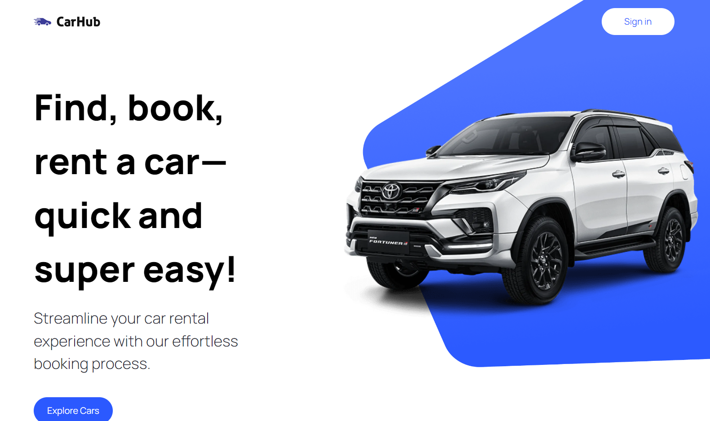

# CAR EXPLORER

Car explorer is car rental project based on NEXTJS 13, in this project we explore features such rapidapi, nextJS server rendering and client client rendering, tailwindcss.

Project-link [link](https://car-explorer.vercel.app/)



## Getting Started

First, run the development server:

```bash
npm run dev
# or
yarn dev
# or
pnpm dev
```

Open [http://localhost:3000](http://localhost:3000) with your browser to see the result.


## Deploy on Vercel

Official link [link](https://thegreateagle.netlify.app/)
